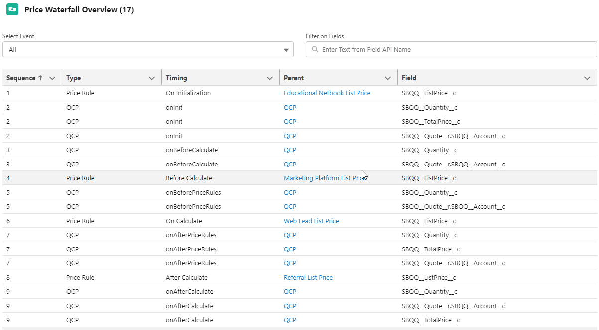

# CPQ - Pricing Logic Review

This tool is for use in troubleshooting the Salesforce CPQ Price Waterfall.  

**Disclaimer**:  This is a very picky tool built to aid in an incredibly tedious process.  It is pretty crude as primary audience is CPQ builder/troubleshooter.  Hopefully it's still useful for your purposes.

## CPQ Price Waterfall Background:
- Salesforce Help:  https://help.salesforce.com/s/articleView?id=sf.cpq_quote_calc_process.htm&type=5
- Laid out in nicer format:  https://archwise.io/cpq-pricing-logic-quickview/

## Requirements
- QCP must be structured in recommended format and exported all methods:  https://developer.salesforce.com/docs/atlas.en-us.222.0.cpq_dev_plugins.meta/cpq_dev_plugins/cpq_dev_jsqcp_methods.htm
- Highly suggest using the following extension for vs code:  https://marketplace.visualstudio.com/items?itemName=paustint.sfdc-qcp-vscode-extension
- SBQQ Package must be installed. 

## What Does it Do?
- Scans your QCP File for Field API Names.  Gathers unique list per QCP method.
- Checks Price Action target fields for API Names
- Buckets referenced fields by Source (QCP or Price Action)
- Orders referenced fields by Price Waterfall calculation step
- Searchable and Sortable Table with Hyperlinks to records for further review/adjustment

## Installation
- Create Custom Label titled 'QCPName' with your SBQQ__CustomScript__c record api name.
- Create Controller and Test class from repository
- Note:  Depending on your SBQQ version, you may have to adjust class .xml for dependency matching.
- Create LWC from repository
- Add LWC to Lightning App Page, Home Page or Lightning Record Page.

## Instructions
- Access Lightning App Page, Home Page or Lightning Record Page where you placed the LWC
- Controller will be called, and the fields from your Price Actions or QCP will be loaded.
- Use sort options to adjust Sequence (the order in which your rules will be fired).
- Use 'Filter on Fields' to filter by API Name of the Field.
- Use 'Select Event' option to only see the fields for a particular event in your waterfall.
- Access Hyperlinks to get to your QCP or to the Price Action where the field was found.

## Future Enhancement Ideas
- Distinguish between source fields and target fields in QCP
- ~~Price Action is looking at targeted fields currently which isn't quite what QCP is doing.  Add Source Field and Source Formula Field scans to also provide Price Action inputs.~~
- Price Rule -> Error Conditions could be added, and fields gathered, so additional source/triggering information can be given
- Add Field Labels column and derive from Field API name to show in table for easier visibility
- Prevent commented out lines from coming out of the QCP.  May be tricky.
- Add pagination to table.  
- Give more conditional functionality/formatting control to user through api/input values.
